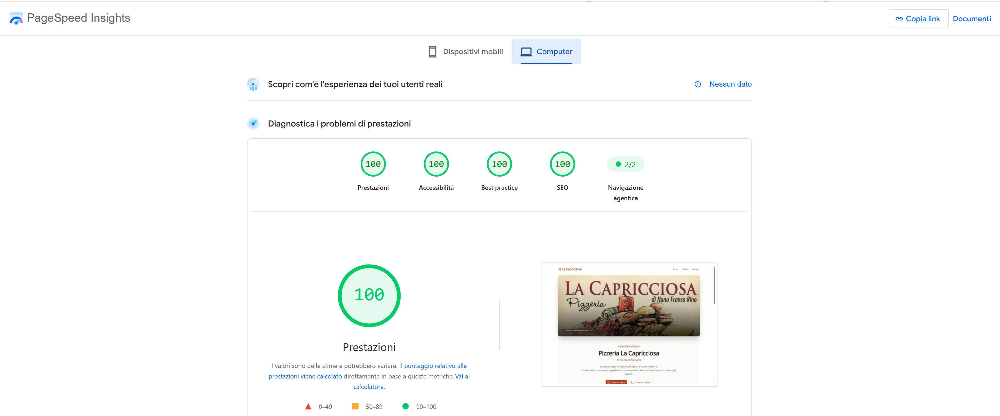
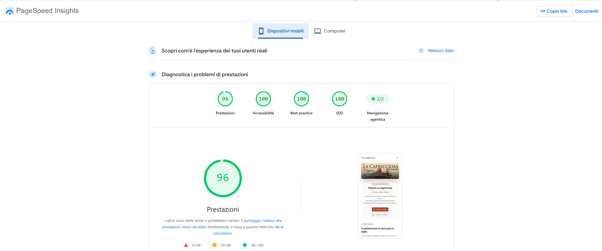

# 🍕 La Capricciosa | Pizzeria Sito Web

Un sito web moderno, responsive e ad alte prestazioni sviluppato in onore alla pizzeria 'La Capricciosa' di Nuoro. Questo progetto è stato realizzato nell'ambito del mio portfolio personale per mostrare competenze avanzate nello sviluppo frontend.

## 🔗 Link Utili

- **Demo Live:** [Visualizza il sito online](https://la-capricciosa.vercel.app/)

---

## ✨ Funzionalità Principali

- **Menu Digitale Interattivo:** Esplorazione delle pizze e dei prodotti con filtri per categoria.
- **Design Moderno:** Interfaccia pulita realizzata con Nuxt UI e Tailwind CSS.
- **Responsive a 360°:** Ottimizzato per mobile, tablet e desktop.
- **Sezioni Dedicate:** Storia, orari, mappa e contatti rapidi.

---

## 🛠️ Stack Tecnologico

- **Framework:** Nuxt 4 (Vue.js SSR Framework)
- **UI & Styling:** Nuxt UI & Tailwind CSS v4
- **Linguaggio:** TypeScript
- **Package Manager:** pnpm

---

---
## 🚀 Prestazioni (PageSpeed Insights)

Ecco le prestazioni del sito verificate su Google PageSpeed Insights.

Versione desktop:

Versione mobile:

---

## 🛑 Proprietà Intellettuale & Utilizzo del Codice

Questo repository è pubblicato su GitHub **esclusivamente a scopo di portfolio e consultazione visiva**. 
* **Non è consentito** clonare, copiare, ridistribuire o utilizzare questo codice sorgente per progetti commerciali o personali senza esplicita autorizzazione dell'autore.
* Per testare l'applicazione, si prega di fare riferimento esclusivamente alla **[Demo Live](https://la-capricciosa.vercel.app/)**.

---

## 👤 Autore

**[Pierpaolo De Rosas]**
- LinkedIn: [linkedin.com/in/pierpaolo-de-rosas](https://www.linkedin.com/in/pierpaolo-de-rosas)
- GitHub: [github.com/Pierp23](https://github.com/Pierp23)
